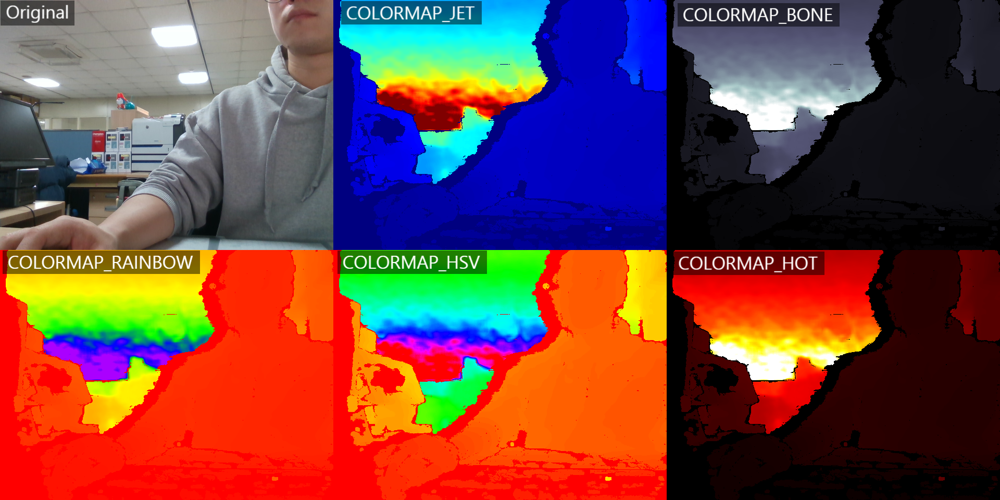

# Usage sample
* Start \'D435_PyServer_TCP.py\' first   
* This example is tested using the [Intel D435](https://www.intelrealsense.com/depth-camera-d435/) for depth image streaming. 
    * if you want more example codes for Intel cameras using python, go to the github link below. 

 

### Test 

### Reference 
* [Sample Code for Intel RealSense Python Wrapper, Github](https://github.com/IntelRealSense/librealsense/tree/master/wrappers/python/examples)
* [Visual Analytics using OpenCV and RealSense Camera](http://blog.cogitomethods.com/visual-analytics-using-opencv-and-realsense-camera/)
